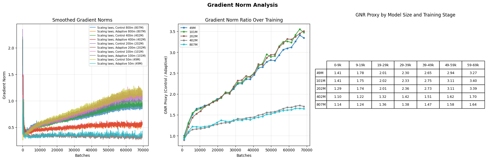

# Gradient Noise Theory

## What is this?

This short writeup is a bit of a distillation of key discoveries, theoredical breakthroughs, and emperical experiments that have been peformed and their implications on LLM training. 

It discusses the unusually large amount of gradient noise that has been detected in standard LLM model training, and that there are detectable training consequences of this extra noise.

## The Scope of Rigor

A *Scope Of Rigor* is a formal statement of what kind of conclusions should be read as fact, supported conjecture, weak conjecture, or mere speculation. It lists conditions of experimentation and thus scopes the regimes and confidence with which we can apply conclusions.

I would personally prefer all paper methodology sections have a scope of rigor section defending the ability to draw conclusions from the methodology, but I do not make the rules.

### Experimental scope

Experimentation has largely occurred within the 50m-800m model range, across a custom, GPT2, Mistral, and Llama architectures, and using the C4, wikitext-103, and pile datasets on the pretraining task. These were executed largely independently, however, without full hyperparameter tuning due to severe budget limitations.

However, this experimentation (as of writing) was performed primarily on the loss hypothesis formulation. Some level of experimentation has been performed on the more novel Gradient Norm Threshold Scheduling formulation, and the formulation was developed from probing the loss formulation, but it is a significant limitation.

We hope to address this soon. Nonetheless, we make the following claims nonetheless:

* Controls are representive of low resource training in the 50m-800m: Starting from reaconable defaults and then scaling up while not retuning hyperparameters is often how small labs have to do their work.
* The model experiments are provisionally representative of small model training in the 50m-800m regime: Exact relationships may change under hyperparameter seeks, but the effects cannot be explained away.
* Grounds for provisional scaling law conjecture exists. However, these conjectures are strongly limited by lack of true hyperparameter search, and can only be said to be representative of low-resource scaling.
* Limitations apply in the most promising formulation; Conclusions on the Gradient Norm Threshold Scheduling formulation are strong conjecture, but lack the data points across scales and models to be provisionally representative at this time. Please by all means help me fix that!

Overall, metric and gradient theory drawn from the series of experiments can be accepted as provisionally representative in the 800m-50m parameter model regime and strongly supported conjecture into the 10b or so parameter model regime. Large model scaling is an unknown factor.

# Gradient Noise Theory

## Introduction

We will be discussing the task of training a general language reasoning model, a Large Language Model, for generalization purposes. In these cases, generally-usable patterns are the training objective to allow the reuse of the model outside of the original distribution on novel tasks. While some level of memorization is actually desirable for many purposes, we will momentarily neglect this.

Within this training paradigm, there can broadly be said to be two types oftraining errors that occur in the gradients used to train modern models that largely have to do with quality of sampling. We distinguish them into **Distribution Errors** and **Sampling Errors**:

* **Distribution Error**: Differences between training and true distribution. A true hypothetical training distribution $P_{true}$ would encode the training data that exactly trains our model to produce the model behavior. If the actual training distribution $P_{train}$ does not match what we want, the model's gradients per step are far from ideal. 
* **Sampling Error**: In theory, the most generally useful gradients are produced by running $P_{train}$ through the model, then taking a step based on the mean of the gradients. In reality, samples $P_{N, train}$ are taken from the distribution in the form of minibatches; as such, there will tend to be error in the 

Distribution errors are of course of considerable concern, but are largely handled by dataset preprocessing. Sampling errors exist, but are largely assumed to be of small enough magnitude not to matter. We find this not to be true, however, within the LLM domain of small models. *So long as it is presumed that the true step is the mean of all gradients from $P_{train}$, it is provably the case that in some situations over 95% of the gradient signal of a single batch are noise.*

## Sampling Error Theory.

We can formalize sampling error theory as follows, and develop a mechanism to quantify the effect.

Presume following standard gaussian error theory that it is the case that, with $\mu_t$ and $\Sigma_t$, every minibatch stage consists of a draw of examples from a normal distribution about the true mean, that is presume that the gradients have the property that

$$G_{tn} = \Del L_t(P_{n}) \approx \mathcal{N}(\boldsymbol{\mu}, \boldsymbol{\Sigma})$$ 

That is, we can represent the gradients as random draws from a vector gaussian distribution with a particular covariance. Modeled this way, the mean of multiple gradient draws converges in a predictable way. Supposing we average a significant number of gradients together

$$G' = 1/(N) \sum_{n=1}^{N} G_{tn}$$

The gradient tends to convert towards a mean and with a variance in:

$$ G' = \mathcal{N}(\boldsymbol{\mu}, \boldsymbol{\frac{\Sigma}{N}})

This immediately implies a convergent distribution, which will eventually when given enough samples converge to near the true vector. As such, we provisionally suggest the **Gradient Norm Ratio (GNR)** as a mechanism to measure gross noise.

Let $G_{t1}, G_{t2}, \ldots, G_{tN}$ be $N$ independent gradient draws at training step $t$. Define:

$$\bar{G}_t = \frac{1}{N} \sum_{n=1}^{N} G_{tn}$$

as the mean gradient over all samples. Let $||\cdot||$ denote the gradient norm as computed above (L2 norm of L2 norms across parameter groups).

We define the **Single-Sample Gradient Norm** as:

$$\text{SSGN}_t = \mathbb{E}_n[||G_{tn}||] \approx \frac{1}{N} \sum_{n=1}^{N} ||G_{tn}||$$

And the **True Gradient Norm** as:

$$\text{TGN}_t = ||\bar{G}_t|| = \left|\left|\frac{1}{N} \sum_{n=1}^{N} G_{tn}\right|\right|$$

The **Gradient Norm Ratio** is then:

$$\text{GNR}_t = \frac{\text{SSGN}_t}{\text{TGN}_t} = \frac{\mathbb{E}_n[||G_{tn}||]}{||\bar{G}_t||}$$

Under our Gaussian noise model, as $N \to \infty$, $\bar{G}_t \to \boldsymbol{\mu}_t$ and thus $\text{TGN}_t \to ||\boldsymbol{\mu}_t||$. Meanwhile, $\text{SSGN}_t$ reflects the expected magnitude of noisy single-sample gradients.

A GNR substantially greater than 1 indicates that single-sample gradients are dominated by noise that cancels upon averaging. Specifically, if $\text{GNR}_t \approx k$, then approximately $\frac{k-1}{k}$ of the single-sample gradient magnitude is attributable to sampling noise rather than the desired generalization signal. We emphasize again this is not necessarily a bad thing; if you are training for an Information Retrieval task this is not noise. But for generalization purposes, it is useless.

## Primary Claims

We make two primary claims

* These effects produce detectible levels of gradient noise that are far beyond what most practictioners would expect to detect in modern models.
* These effects can be measurably linked to harming training, with solid theoredical mechanisms, and primarily it is the varying magnitude from the true $m_t$ causing harm.

We also propose some strong conjectures

* One of the primary effects of scaling up models is to reduce the GNR and thus speed up training. However, reducing the GNR directly can recover much of these effects in smaller models.

# Evidence

While not yet formally probed across all scales and architectures, the evidence seems pretty damning. There is a lot more noise than signal for training generalization tasks in small scale models. 

## 50m using Gradient Norm Threshold Scheduling formulation.

With a batch size of 32, our models at 50m were found to be able to drive down the TGN to around 0.1 in magnitude over the schedule period. This is despite draws starting with a mean of around 1.7 magnitude. Scaling up by sqrt(32) to account for variance from the batching, this would suggest a SSGN of around 9.7, putting the GNR at around 96. Even if this approximation is wrong, we at least can bound the factor in 17.

At a minimum, 1/17 - around 95% - of the naive training signal did not relate to generalization at 50m. This

The next generation of experiments are planned to more firmly pin down these numbers under a broad range of training conditions. This alone would be qualified as strong conjecture, but when supported with the loss hypothesis evidence must be taken as preliminarily supported.

## Span over studies using Loss Hypothesis formulation.

The loss hypothesis has, as of this writing, been tested far more thoroughly. It also showed evidence of such phenomenon. We study the scaling law study in particular for evidence.

The GNR approximations were simply the ratio of observed control to test gradient norms. It should be noted that the LH formulations tended to decrease gradient norms over training, and as such we can know that the TGN must have been at least the norm value at a particular training step. We also note one of the claimed effects may be in action - it is the case the GNR proxies get more favorable the larger the model. However, full-scale testign with the Gradient Norm Threshold Scheduling implementation with explicit GNR ratio tracking will be needed to know for sure.

We can, however, place bounds on the GNR. The ratio as greater than 3.8 at points for the small scale models, and at least 1.7 for 800m, based on the ratios. It cannot be reasonably 
Implications at large scale must currently treated as purely conjecture due to issues of hyperparameters. Nonetheless, we would weakly conjecture that large scale models when tuned for maximum performance, between the learning rate modifications, suffer from these effects.

## Directional Gradient Variance

In exploration of the effect, we tested taking the cosine similarity between the running first moments, representing the typical direction of motion, and the gradients at each step. If the direction is significantly different, this could harm convergence according to the difference between them.

Did it differ? Not really. Past initial stages of training the angles rarely differed by more than 0.1 degrees on the 50m models explored. This would likely make larger models more conservative, not less. Provisionally, we accept the hypothesis that gradients usually point in the right direction when training and angular difference is not materially harming training.

## Adam Step Factos

The adam step factors show the payoff for controlling the variance. Both the loss formulation, and later the GNTS formulation showed these effects, with the GNTS formulation directly accumulating until the gradients reached a particular norm and so keeping the norm aidebatically constant during a given phase of training. The results speak for themselves

